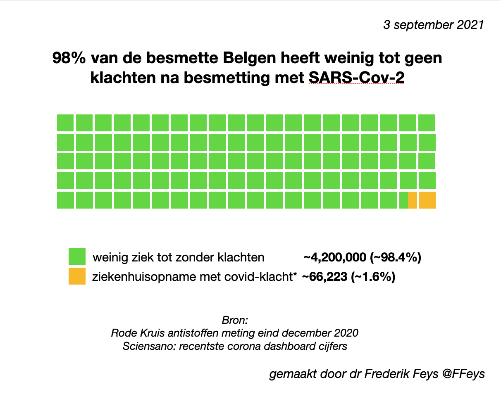

```{r setup, include=FALSE}
knitr::opts_chunk$set(include = FALSE)
library(dplyr)
source("shared/general.R")
```

> Zou voorafbestaande T-cell en B-cell immuniteit al bescherming kunnen bieden ?

+ Reeds bestaande immuniteit verdringt de naïeve gedachte dat antilichamen de enige vorm van afweer zijn.
+ Blootstelling leidt niet noodzakelijk tot infectie, infectie zal niet noodzakelijk leiden tot ziekte, en ziekte zal niet noodzakelijk tot detecteerbare antilichamen leiden. 
+ Er is een hoge graad van immuniteit onder de bevolking

Half Juli 2020 was het weer van dat. Expert-virologen sloegen alarm want het aantal positief geteste mensen steeg dagelijks. Er zou een tweede golf met hospitalisaties en doden komen. Ik neem aan dat dit uit hun  voorspellende modellen komt. Helaas zijn die modellen "fout, hoogstens hier en daar nuttig." (quote van Brits statisticus George Box) De epidemiologische werkelijkheid is namelijk ingewikkeld. De tweede golf kwam er ook niet.Dat was voor het najaar.

In tegenstelling tot Maart-April 2020, voorspelden de 'zomerse' cases niet goed de hospitalisaties of overlijdens. Dat komt onder andere omdat [de leeftijd van de cases veel jonger is](post-6-covid-verdwijnen.html) (zie hoofding 'Jongere cases'). De virusbesmettingen lopen dus doorheen de bevolking in twee golven. De eerste periode bij oudere (zwakkere) mensen en de zomer 2020 bij jongere (sterkere) mensen. Maar misschien groeide de immuniteit ook al aardig aan? 

<!-- Onderzoek geeft aan dat ook voor het coronavirus 'geheugen' afweercellen en gekruiste immuniteit aanwezig is. Het doet vermoeden dat we dicht bij een groepsimmuniteit zijn.  -->

## Immuniteit

Als er veel mensen immuun zijn dan ontstaat groepsimmuniteit. Het is de verhouding 'immune' versus vatbare personen in een bevolking. De 'immunen' vormen een barriere tegen de verpreiding van het virus. Zelfs met een zeer makkelijk overdraagbare ziekte zoals covid-19 die voor een epidemie zorgde, zullen veel niet-immune personen beschermd zijn omdat hun kans klein is in contact te komen met een geïnfecteerde persoon. 

### Aangeboren

Vooral kinderen hebben een sterke aangeboren afweer. Hun ziektesymptomen zijn vaak heftig. Denk aan de hoge koorts en zwakte door de ziekte. Maar ze genezen ook sneller. Door de vele infecties en genezingen groeit tijdens de kinderjaren langzaam de verworven immuniteit aan.

### Verworven

Na een eerste infectie verdwijnen afweerstoffen vrij snel. Tegelijk 'onthoudt' het lichaam de kenmerken van het virus (of een andere ongewenste indringer). Als die indringer een volgende keer aanklopt, zal het lichaam een zeer sterke afweer tonen (sterker dan de eerste keer). Die immuniteit kan soms jarenlang blijven. 

Bij mensen boven de 80 jaar zien we bijna geen verworven afweer meer [Herzog](https://doi.org/10.1101/2020.06.08.20125179) / [Monash University](https://medicalxpress.com/news/2020-06-cell-immunity-elderly.html). Ze zijn daarom kwetsbaar voor ziekte.

```{r}

infected <- population_be * Sero_Prev_BE/100
infected_lower <- population_be * Sero_Prev_BE_lower/100
infected_upper <- population_be * Sero_Prev_BE_upper/100

off_cases_until_dec = 650000
infections_december_2020_now = 540000
multiplyer_lower = infected_lower / off_cases_until_dec
multiplyer_upper = infected_upper / off_cases_until_dec

#current estimates
infections_december_2020_now_lower = infections_december_2020_now * multiplyer_lower
infections_december_2020_now_upper = infections_december_2020_now * multiplyer_upper

# totals
infected_current_lower = infected_lower + infections_december_2020_now_lower
infected_current_upper = infected_upper + infections_december_2020_now_upper
infected_current_prop_lower = round(infected_current_lower/population_be * 100, 1) 
infected_current_prop_upper = round(infected_current_upper/population_be * 100, 1) 
```


Eind december 2020 hadden naar schatting minstens tussen de `r format(infected_lower, big.mark = ",") ` (`r Sero_Prev_BE_lower` %) en `r format(infected_upper, big.mark = ",") ` (`r Sero_Prev_BE_upper` %) Belgen  verworven of natuurlijke immuniteit op. ([Sciensano covid-monitor](https://datastudio.google.com/embed/reporting/7e11980c-3350-4ee3-8291-3065cc4e90c2/page/ZwmOB)). Extrapolatie op basis van het aantal officiële besmettingen en met de wetenschap dat herbesmettingen zelden voorkomen, zou aangeven dat vandaag tussen de `r format(infected_current_lower, big.mark = ",") ` (`r infected_current_prop_lower` %) en `r format(infected_current_upper, big.mark = ",") ` (`r infected_current_prop_upper` %) Belgen natuurlijke immuniteit hebben tegen covid-19.

Vandaag zouden we dan deze situatie hebben:



### Vaccinatie

Vacccinatie geeft bijkomende bescherming tegen covid. Vandaag zijn 8.146.325 (70.7%) Belgen gevaccineerd. 

## Wat is de Belgische groepsimmuniteit bij COVID-19?

Niemand weet het exact. Maar er zijn wel aanwijzingen. Op plekken waar mensen dicht bij elkaar zijn (stad, evenement of cruise schip) zien we het aantal infecties niet hoger gaan dan 10 tot 20%. Daarna stopt de aangroei. Het algemene misverstand is dat er geen enkele immuniteit zou zijn bij dit nieuwe coronavirus. En dat groepsimmuniteit pas bereikt zou zijn als 60-70% gevaccinneerd is. 

### Geen enkele immuniteit?

Er zijn al vele studies die wijzen op gekruiste immuniteit. Onbesmette mensen bouwden al afweer op tegen het nieuwe coronavirus door eerdere verkoudheden en griepachtige infecties. Naar schatting 50% heeft al kruis-immuniteit [Nguyen-Contant](https://doi.org/10.1101/2020.07.20.213298) /  [Braun](https://doi.org/10.1101/2020.04.17.20061440) / [Grifoni](https://doi.org/10.1016/j.cell.2020.05.015) / [Mateus](https://science.sciencemag.org/content/sci/370/6512/89.full.pdf). [Le Bert](https://www.nature.com/articles/s41586-020-2550-z) spreekt in Nature over _eerdere blootstellingen aan betacoronavirusen die multispecifieke en langdurige T cell immuniteit tegen het structuur N eiwit opleveren_. Ook andere studies wijzen op bestaande immuniteit tegen het SARS-CoV-2 virus [Loyal](https://www.science.org/doi/10.1126/science.abh1823) / [Ng](https://science.sciencemag.org/content/370/6522/1339) / [Sekine](https://doi.org/10.1101/2020.06.29.174888) / [Meckiff](https://dx.doi.org/10.2139/ssrn.3641939) / [Weiskopf](https://doi.org/10.1101/2020.04.11.20062349). Een degelijk onderzoek van Nelde & collega's in Nature Immunology vindt dat [80% van de niet-besmette mensen immuniteit](https://www.nature.com/articles/s41590-020-00808-x) hebben voor het nieuwe coronavirus. Ze vinden ook een verband tussen de hoeveelheid antilichamen en de ernst van de doorgemaakte ziekte. Een mogelijke verklaring waarom mensen met milde of onopgemerkte covid-19 weinig of geen antilichamen aanmaken. En toch immuniteit kunnen hebben.

Dit is niet zo vreemd aangezien er minstens 4 soorten coronavirussen zijn die griep/verkoudheid veroorzaken. Dit kan ook verklaren waarom 98,4% van de mensen nadat ze positief testen voor het coronavirus weinig ziek zijn of geen klachten doormaken. Dat zijn dan vooral kinderen, jongeren en volwassenen van middelbare leeftijd.

Dit wil zeggen dat al die snotneuzen van verkoudheden ons afweersysteem al voorbereidden om COVID-19 te bekampen. Overvloedig noemden media en experts dit een 'nieuw virus'. In werkelijkheid is het een ander type coronavirus is dat zeer sterk gelijkt op de gekende verkoudheids-coronavirussen.  

### Een poging tot berekening

Als 50 tot 80 % van de bevolking al kruisimmuniteit heeft voor SARS-CoV-2, zijn 20 tot 50% nog vatbaar. We hebben tussen de `r round(infected_current_prop_lower,0) `% en  `r round(infected_current_prop_upper,0)` % Belgen met nieuwe natuurlijke immuniteit. Deze bescherming en de bestaande kruisimmuniteit en bescherming door vaccinatie, geeft ruwweg 71-89 % groepsimmuniteit. Dat is een percentage dat epidemiologen klassiek nodig achten voor groepsimmuniteit bij een luchtwegenvirus. 

Recent stellen [Gabriela Gomes](https://doi.org/10.1101/2020.07.23.20160762) de klassieke gedachte van 70% nodige groepsimmuniteit in vraag. Zij zegt dat infecties niet homogeen verspreiden. Ze verspreiden vooral via kwetsbare mensen die in contact staan met vele anderen. En dus zijn ze sneller immuun. Hierdoor zullen heterogene bevolkingen minder infecties nodig hebben om de groepsimmuniteit te bereiken. Gomes en collega's schatten groepsimmuniteit bij 10 to 20%. Omwille van voorafbestaande immuniteit, deelt [Gupta en collega's](https://doi.org/10.1101/2020.07.15.20154294) ook in een lagere schatting van 10%.

Deze belangrijke onderzoeken rond kruis-immuniteit staan in top wetenschappelijke tijdschriften zoals Nature en Science. Toch negeert de mainstream media deze vorm van immuniteit  grotendeels. Waarschijnlijk door sensatiezucht, politieke en farmaceutische belangen. Reken dat de farmaceutische industrie met vaccins aan [8,45€](https://www.vrt.be/vrtnws/nl/2020/12/17/prijzen-vaccins/) per stuk in België alleen al 280,000,000 euro binnenhalen. Huisartsen verdienen 10€ per vaccinprik. Het financieel belang is zo extreem groot dat het helaas loont om de bevolking bang te houden met negatieve berichten, lockdowns, mondmaskers, enz.... totdat het vaccin massaal is toegediend. 

Ik haalde veel inspiratie bij onder andere dit artikel [Covid-19: Do many people have pre-existing immunity?](https://www.bmj.com/content/370/bmj.m3563 ) in de British Medical Journal

[Teken de brief die meer aandacht vraagt voor natuurlijke immuniteit](https://frederikfeys.be/natuurlijke-immuniteit/)

```{r eval=FALSE, include=FALSE}
# get the cases

d_c <- read.csv("https://epistat.sciensano.be/Data/COVID19BE_CASES_AGESEX.csv")
agg_d_c <- aggregate(x = d_c$CASES, FUN = sum,
                   by = list(Group.date = d_c$DATE))
names(agg_d_c)[names(agg_d_c)=="x"] <- "cases"

# make date object
agg_d_c$Group.date = as.Date(agg_d_c$Group.date)

# get the hospitalisations
d_h <- read.csv("https://epistat.sciensano.be/Data/COVID19BE_HOSP.csv")

agg_d_h <- aggregate(x = d_h$NEW_IN, FUN = sum,
                     by = list(Group.date = d_h$DATE))
names(agg_d_h)[names(agg_d_h)=="x"] <- "hosp"

# make date object
agg_d_h$Group.date = as.Date(agg_d_h$Group.date)
g_t_h <- sum(agg_d_h$hosp)

# calc 7 day hosp avg

startdate <- min(agg_d_h$Group.date)
date_to_avg <- startdate + 7
days_to_avg <- nrow(agg_d_h) -7

df <- data.frame("2020-03-15", '0')
names(df) <- c("Group.date", 'hosp')
df$Group.date = as.Date(df$Group.date, origin="1970-01-01")
df$hosp = as.integer(df$hosp)

for (i in 1:days_to_avg) {
  row = agg_d_h[which( agg_d_h$Group.date >= startdate & agg_d_h$Group.date < date_to_avg) , ]
  daily_avg = round(sum(row$hosp) / 7, 0)
  rm(row)
  
  df[nrow(df) + 1, 1] = date_to_avg
  df[nrow(df) , 2] = daily_avg
  
  startdate <- startdate + 1
  date_to_avg <- date_to_avg + 1
}

# truncate
d_h <- df[df$Group.date > min(agg_d_h$Group.date), ]

# get the icus

# gets the total icus
agg_d_i <- aggregate(x = d_h$TOTAL_IN_ICU, FUN = sum,
                     by = list(Group.date = d_h$DATE))
names(agg_d_i)[names(agg_d_i)=="x"] <- "icu"
agg_d_i['new_icu']=0

# convert to daily new estimate
for(i in 1:nrow(agg_d_i)) {
    curr_row = agg_d_i[i, ]   
    low_i = curr_row$icu
    
    if (i < nrow(agg_d_i)) {
      next_row = agg_d_i[i+1, ]
      high_i = next_row$icu
      new_i = high_i - low_i
      if(new_i<0) {new_i=0}
      agg_d_i[i+1, 'new_icu'] = new_i
    }
    
  }

# make date object
agg_d_i$Group.date = as.Date(agg_d_i$Group.date)

# delete hosp column
agg_d_i = select(agg_d_i, -icu)

# get the deaths
d_d <- read.csv('https://epistat.sciensano.be/Data/COVID19BE_MORT.csv')
agg_d_d <- aggregate(x = d_d$DEATHS, FUN = sum,
                     by  = list(Group.date = d_d$DATE, Region = d_d$REGION))
names(agg_d_d)[names(agg_d_d)=="x"] <- "deaths"
write.csv(agg_d_d, "data_morts")
d_a <- read.csv(file = "data_morts.csv", sep = ';')
# make date object
agg_d_d$Group.date = as.Date(agg_d_d$Group.date)

# calc 7 day avg

startdate <- min(agg_d_d$Group.date)
date_to_avg <- startdate + 7
days_to_avg <- nrow(agg_d_h) -7

df <- data.frame("2020-03-15", '0')
names(df) <- c("Group.date", 'deaths')
df$Group.date = as.Date(df$Group.date, origin="1970-01-01")
df$deaths = as.integer(df$deaths)

for (i in 1:days_to_avg) {
  row = agg_d_d[which( agg_d_d$Group.date >= startdate & agg_d_d$Group.date < date_to_avg) , ]
  daily_avg = round(sum(row$deaths) / 7, 0)
  rm(row)
  
  df[nrow(df) + 1, 1] = date_to_avg
  df[nrow(df) , 2] = daily_avg
  
  startdate <- startdate + 1
  date_to_avg <- date_to_avg + 1
}

# truncate and set same start date as hosp
d_d <- df[df$Group.date > min(d_h$Group.date), ]

# make the graphics
# prepare data

# make dataset with the same starting date
# start_date = min(agg_d_c$Group.date)
start_date = min(agg_d_h$Group.date)

add_trailing_dates <- function(data, start_date, target) {
   d_start_date = min(data$Group.date)
   diff_in_days = as.numeric(difftime(d_start_date, start_date, units = "days"))

   # add trailing dates
   
   data_new = data.frame(Group.date = start_date, val = 0)
   next_date = start_date+1
   
   for(i in 1:diff_in_days) {
     next_date  = next_date+1
     data_new_row <- data.frame(Group.date = next_date,  val = 0)
   }
   
   colnames(data_new)[colnames(data_new) == "val"] <- target
   data <- rbind(data_new, data)
   data <- data[order(data$Group.date),]
  return(data)
}

rm(d_h)  
#d_h <- add_trailing_dates(data = agg_d_h, start_date = start_date, target='hosp')
# d_i <- add_trailing_dates(data = agg_d_i, start_date = start_date, target='new_icu')
d_d <- add_trailing_dates(data = agg_d_d, start_date = start_date, target='deaths')

# tie every dataset together
# d_c_h <- left_join(agg_d_c, d_h, by = "Group.date")
d <- left_join(d_h, d_d, by = "Group.date")
#d_c_h_i <- left_join(d_c_h, d_i, by = "Group.date")
#d_c_h_i_d <- left_join(d_c_h_i, d_d, by = "Group.date")
d['label_date'] = NULL
d['label_date'] = as.character(d$Group.date, format = "%d/%m")  

d <- left_join(d_h, d_d, by = "Group.date")

d['label_date'] = NULL
d['label_date'] = as.character(d$Group.date, format = "%d/%m")  

# barplot(d$cases, main = "Evolutie van de nieuwe cases, hospitalisaties en overlijdens.", sub = "bron: corona.frederikfeys.be", names.arg = d$label_date , col="yellow", ylim = c(0, 10000), las=1)

barplot(d$hosp, main = "Evolutie van de nieuwe hospitalisaties en overlijdens.", sub = "bron: corona.frederikfeys.be", names.arg = d$label_date , col="yellow", ylim = c(0, 800), las=1)
# par(new=TRUE) 
# barplot(d$hosp, col="green", ylim = c(0, 2500), axes = F)
par(new=TRUE) 
barplot(d$deaths, col="red", ylim = c(0, 800), axes = F)
abline(h=500, col = "grey", lwd = 0.5)
abline(h=1000, col = "grey", lwd = 0.5)
legend(100, 2200, legend = c("Geel: nieuwe hospitalisaties", "Rood: nieuwe overlijdens"), col = c('yellow', 'red'), lty=1, cex = 0.8)

#lines(d$deaths, col="red")
```

