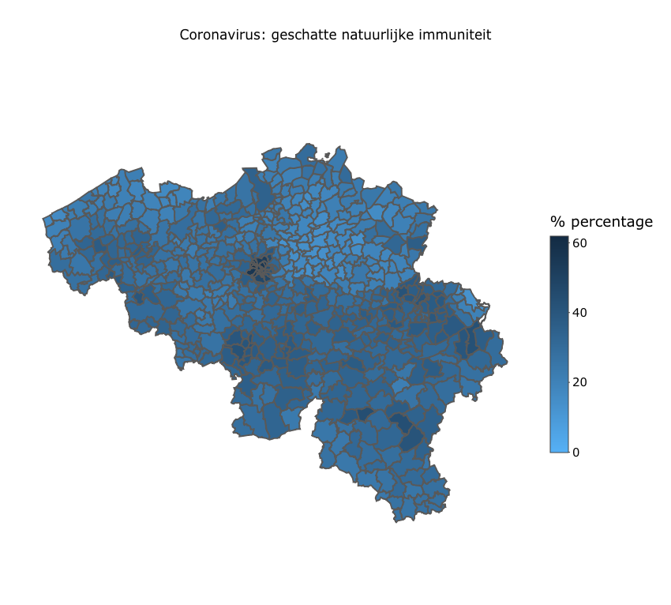
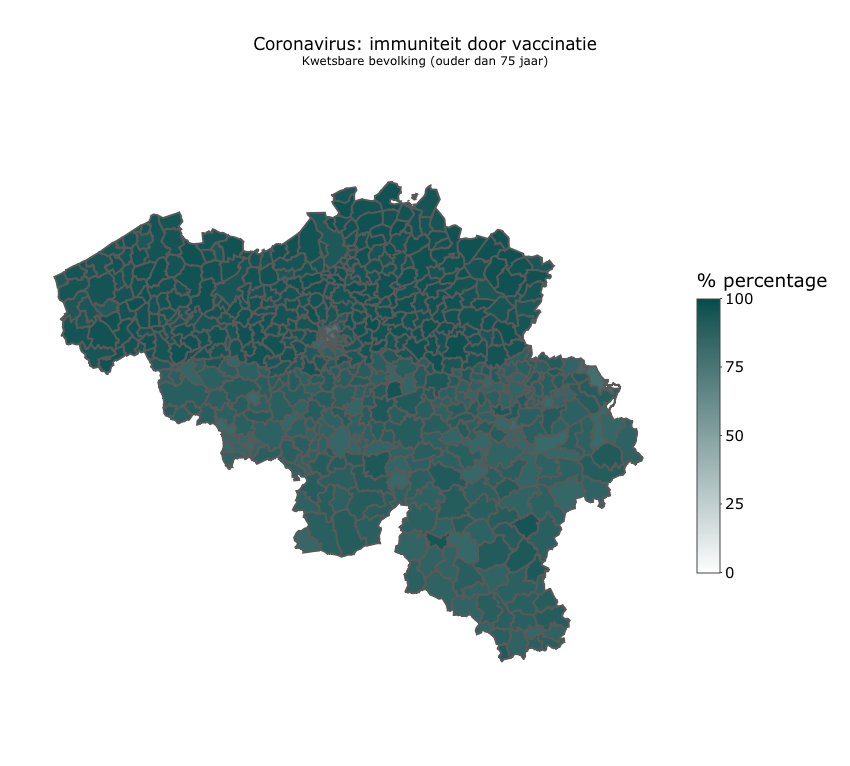
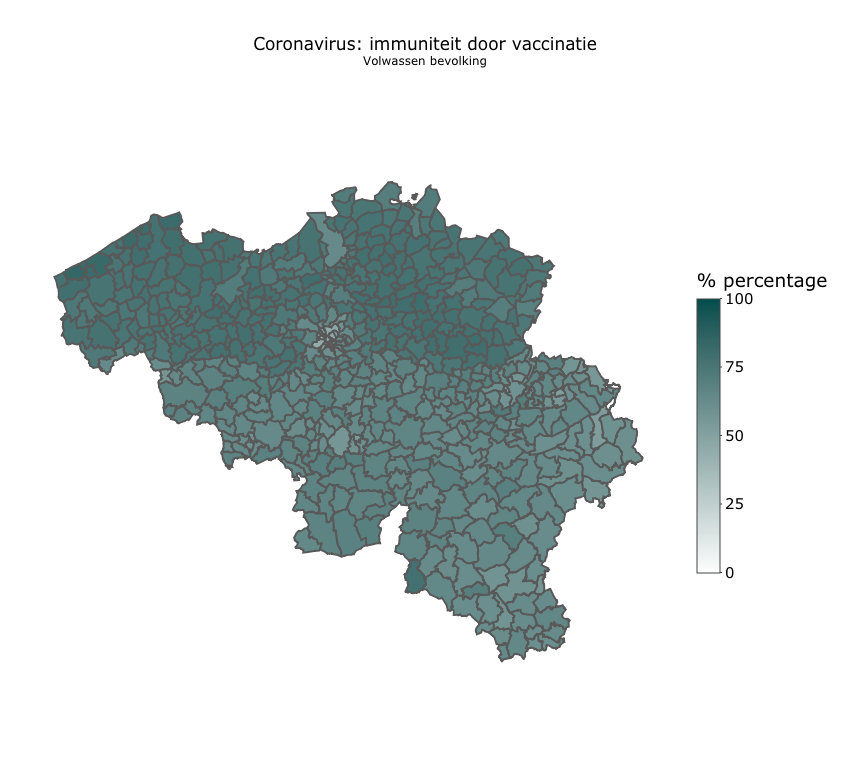

```{r setup, include=FALSE}
knitr::opts_chunk$set(echo = FALSE, warning = F)

update <- FALSE # set to TRUE to get latest live data
tresh_vuln_age <- 75
caption <- "Made by: @FFeys / Data: Sciensano, BelSTAT" # ggplot credidentials displayed on mappings 

source('shared/general.R')  
source('shared/covid-death.R')
source('scripts/geomap.R') 

library(sf) #Simple Features. This is the map-maker
library(tidyverse) #Collection of packages in the tidyverse (see https://www.tidyverse.org/
library(viridis)  #Nicer colors
library(ggthemes) #Nice theme for maps
library(plotly)
library(htmlwidgets) # to save plot widgets to dedicated page
```

```{r geographic-base, message=FALSE, include=FALSE}
# Create geographic data Belgium

shpfile <- '~/Documents/wetenschap/covid-19/infosheets/data/geo-boundary/belgium/Municipality/Apn_AdMu.shp' # https://fin.belgium.be/sites/default/files/Inspiredata/Municipality.zip
emptymap <- st_read(dsn = shpfile) #read the shp format into R

# slim down dataset for needed vars AdMuKey, NameDUT, geometry
emptymap <- subset(emptymap, select = -c(RecId, Version, AdDiKey, AdPrKey, AdReKey, AdCoKey, NameFRE, NameGER, LangCode, FiscSitId, UpdDate, Stat_Area, Shape_Leng, Shape_Area))

# convert factor to integer -> useful when later merging tables
emptymap$NIS5 <- as.numeric(levels(emptymap$AdMuKey))[emptymap$AdMuKey] 
```

```{r population-data}

d_p <- read.csv('~/Documents/wetenschap/covid-19/infosheets/data/TF_SOC_POP_STRUCT_2021.csv', sep = '|')

# get populations by age and location
# all ages
d_p_all <- aggregate(MS_POPULATION ~ CD_REFNIS+TX_DESCR_NL, data = d_p, FUN = sum)
d_p_all$NIS5 <- d_p_all$CD_REFNIS
d_p_all <- subset(d_p_all, select = -c(CD_REFNIS))

# vulnerable
d_p_vuln <- subset(d_p, d_p$CD_AGE >= tresh_vuln_age)
d_p_vuln <- aggregate(MS_POPULATION~CD_REFNIS+TX_DESCR_NL, data = d_p_vuln, FUN = sum)
d_p_vuln$NIS5 <- d_p_vuln$CD_REFNIS
d_p_vuln <- subset(d_p_vuln, select = -c(CD_REFNIS))

```


## Samenvatting

- Als we kijken naar alle immuniteit in België voor het nieuwe coronavirus, dan lijkt er geen verschil in groepsimmuniteit-bescherming tussen Brussel, Vlaanderen en Wallonië.

- De kwetsbare bevolking is in België goed gevaccineerd. 

Na het zien van [deze Tweet van Tom Van de Weghe](https://twitter.com/tomvandeweghe/status/1435559870896513030?s=20) en de bijbehorende map der vaccinatie, vond ik mijn inspiratie voor dit blog. Wat als we neutraal kijken naar de data? En naar *alle* immuniteit in de bevolking? 


Covid-immuniteit kan ontstaan na een doorgemaakte corona-infectie of door vaccinatie. [Recent studiewerk van Gazit](https://doi.org/10.1101/2021.08.24.21262415) toont dat natuurlijke immuniteit tot 27 keer meer bescherming biedt tegen covid dan vaccinatie met het Pfizer-vaccin. Dit is geen verrassing want natuurlijke immuniteit na een infectie is breder doordat de hele virus-molecule als lichaamsvreemde wordt beschouwd. En op die manier betere en langdurige immuniteit biedt. Dankzij 'geheugen' B en T-cellen zelfs tot decennia na de besmetting. Het vaccin biedt ook bescherming, maar beperkter. Het m-RNA vaccin is bevat meer één deel van het hele virus, het zogenaamde 'spike-eiwit'.

Recent is er ophef omdat de vaccinatiegraad in Brussel te laag zou zijn om veilig verder te kunnen. De [Brusselse regering besliste](https://www.knack.be/nieuws/belgie/brusselse-regering-start-voorbereiding-uitbreiding-covid-safe-ticket-vanaf-1-oktober/article-news-1776319.html) om vanaf 1 oktober een coronapas (covid safe ticket) in te voeren. De overheid wil mensen die nog geen vaccinatie wensten, de deelname in het openbaar leven moeilijk maken, in de hoop dat ze toch een prik laten zetten. Ook in Vlaanderen flirt de overheid met det idee iedereen te dwingen om te vaccineren.

Op welke feiten zijn deze maatregelen gebouwd: 

-   hoe is de immuniteit in Brussel, Wallonië en Vlaanderen ?
-   hoe is de immuniteit bij kwetsbare mensen ?

## Aanpak

+ [Sciensano publiceert](https://epistat.wiv-isp.be/covid/) gegevens over infectie per gemeente, maar niet volgens per gemeente en leeftijd. Ik maak dus een overzicht per gemeente voor alle leeftijden. 
+ De officiële besmetting-cijfers zijn een onderschatting van het echte aantal besmettingen. Om een idee te krijgen over deze onderschatting, zal ik de data uit bloedonderzoek naar antilichamen van Belgische bloed-donoren verwerken. Drie onderzoeken met telkens minstens 6 weken tussentijd komen in aanmerking (datum 2020-09-30, 2020-11-11, en 2020-12-22). 

+ Er zijn [per regio aanzienlijke verschillen in het voorkomen van antilichamen](https://www.sciensano.be/nl/pershoek/aantal-bloeddonoren-en-gezondheidswerkers-met-antistoffen-tegen-coronavirus-stijgt). Deze analyse zal dit feit meenemen. 

+ De seroprevalentie bij bloeddonoren kan op zich ook een onderschatting zijn, omdat bloeddonoren vaak gezondere en hoger opgeleide mensen zijn. Ze zijn minder onderhevig aan infectie door krap-bemeten ruimtes, waar soms meerdere generaties onder één dak leven, die zo uiteraard de virusverspreiding versterken.

+ Immuniteit door vaccinatie: 
    + samenvoegen van de vaccinaties waar één dosis volstaat en alle vaccinaties waar al minstens 1 dosis werd toegediend (dit laatste geeft ook idee van de vaccinatie-bereidheid). 
    + ik beschouw enkel de volwassen bevolking. Voor kinderen en jongeren wegen voordelen van vaccinatie niet op tegen de nadelen. Lees [hier](https://twitter.com/FFeys/status/1434235922430758915?s=20) meer.

## Immuniteit door corona-infectie

### Officiëel

```{r natural-immunity}

d_n_raw <- read.csv('~/Documents/wetenschap/covid-19/infosheets/data/COVID19BE_CASES_MUNI_CUM.csv')

if (update) {
  d_n_raw <- read.csv('https://epistat.sciensano.be/Data/COVID19BE_CASES_MUNI_CUM.csv')
}

# complete cases
d_n<- d_n_raw[complete.cases(d_n_raw),]

# merge with population data
# to avoid duplicate columns, we first remove 
d_n <- subset(d_n, select = -c(TX_DESCR_NL))
d_n <- left_join(d_n, d_p_all, by = 'NIS5')
d_n$rate <- round(d_n$CASES/d_n$MS_POPULATION*100, 1)

# seroprevalence estimates
d_sp_studies <- data.frame(Date = c('2020-09-30', '2020-11-11', '2020-12-22'), 
                           Mean_sp = c(0.048, 0.136, 0.196),
                           Flanders = c(NA, 0.10, NA),
                           Brussels = c(NA, 0.26, NA),
                           Wallonia = c(NA, 0.18, NA))

# means and CI by region
regions <- c('Flanders', 'Brussels', 'Wallonia')

get_means_by_region <- function(data){
  #create data frame with 0 rows and 4 columns
  df1 <- data.frame(matrix(ncol = 4, nrow = 0))
  #provide column names
  colnames(df1) <- c('region', 'mean', 'lower95CI', 'upper95CI')
                    
  for (i in 1:length(regions)) {
    
    d_n_region <- subset(data, data$REGION == regions[i])
    
    avg <- mean(d_n_region$rate)
    sd <- sd(d_n_region$rate)
    n <- nrow(d_n_region)
    error <- qnorm(0.975)*sd/sqrt(n)
    lower <- avg - error
    upper <- avg + error
    
    #define second data frame
    df2 <- data.frame(region=regions[i],
                      mean = avg,
                      lower95CI = lower,
                      upper95CI = upper)
    #append the rows of the second data frame to end of first data frame
    if (i==1) {
      d_regions <- rbind(df1, df2)
    } else {
      d_regions <- rbind(d_regions, df2)
    }
  }
  return (d_regions)
}

d_regions <- get_means_by_region(d_n)
d_regions$sp_nov_2020 <- c(d_sp_studies[2, 3], d_sp_studies[2, 4], d_sp_studies[2, 5])
```

```{r plot }
# Make the graph with the 95% confidence interval
library(ggplot2)
ggplot(d_regions, aes(x=region, y=mean, group=1)) +
    geom_line() +
    geom_errorbar(width=.1, aes(ymin=lower95CI, ymax=upper95CI)) +
    geom_point(shape=21, size=3, fill="white") +
    ylim(0,15) +
    theme_bw() +
    labs(title = 'Aandeel natuurlijke immuniteit per regio',
         subtitle = 'op basis van de officiële tests',
         caption = paste('Verticale lijnen zijn de 95% betrouwbaarheidsintervallen', sep = ' / ', caption ) ,  
         x = "Regio",
         y = "Aandeel (%)")
```

Op basis van de officiële tests, heeft Vlaanderen de minste, en Brussel en Wallonië de meeste afweer opgebouwd.

### Best mogelijke schatting

De overgrote meerderheid van de besmettingen komt echter niet voor in de statistieken van het aantal bevestigde gevallen. Dat komt omdat die niet-vastgestelde besmettingen vaak mild of zonder klachten verlopen. Ze maken dat de werkelijke immuniteit onder de bevolking dus (veel) hoger is. Bloedonderzoek naar antilichamen geeft een idee van de werkelijke immuniteit. 

Zo zien we medio november 2020 per regio deze resultaten:

```{r plot2 }
# Make the graph with the 95% confidence interval
library(ggplot2)
ggplot(d_regions, aes(x=region, y=sp_nov_2020*100, group=1)) +
    geom_line() +
    geom_point(shape=21, size=3, fill="white") +
    ylim(0,30) +
    theme_bw() +
    labs(title = 'Medio november 2020: Aandeel natuurlijke immuniteit per regio',
         subtitle = 'op basis van antilichamen uit bloedonderzoek',
         caption = paste('', sep = ' / ', caption ) ,  
         x = "Regio",
         y = "Aandeel (%)")
```

Deze grafiek toont dezelfde tendens als de officiële besmettingen. Nl, meer afweer in Brussel en Wallonië dan in Vlaanderen.

```{r estimate-natural-immunity}

d_t_raw <- read.csv('~/Documents/wetenschap/covid-19/infosheets/data/COVID19BE_tests.csv')
if (update) {d_t_raw <- read.csv('https://epistat.sciensano.be/Data/COVID19BE_tests.csv')}

# correct using seroprevalence (sp) data for PCR tests underestimating true prevalence of infections
# to get a more precise estimate of underreporting we first sample three periods at least 6 weeks apart

sum_uf <- 0

for (i in 1:nrow(d_sp_studies)) {
  d_t <- subset(d_t_raw, as.Date(d_t_raw$DATE) < as.character(d_sp_studies[i,1]) )
  pos_t <- sum(d_t$TESTS_ALL_POS)
  seropos <- round( d_sp_studies[i,2] * population_be, 0)
  underestimate_factor <- round(seropos / pos_t, 1) 
  sum_uf <- sum_uf + underestimate_factor
  mean_uf <- round (sum_uf/nrow(d_sp_studies), 2)
  
  if(!is.na(d_sp_studies[i,3]) & !is.na(d_sp_studies[i,4]) & !is.na(d_sp_studies[i,5])) { # we have data for regions
     d_t_fl <- subset(d_t_raw, as.Date(d_t_raw$DATE) < as.character(d_sp_studies[i,1]) & d_t_raw$REGION == regions[1])
     d_t_br <- subset(d_t_raw, as.Date(d_t_raw$DATE) < as.character(d_sp_studies[i,1]) & d_t_raw$REGION == regions[2])
     d_t_wa <- subset(d_t_raw, as.Date(d_t_raw$DATE) < as.character(d_sp_studies[i,1]) & d_t_raw$REGION == regions[3])
      pos_t_fl <- sum(d_t_fl$TESTS_ALL_POS)
      pos_t_br <- sum(d_t_br$TESTS_ALL_POS)
      pos_t_wa <- sum(d_t_wa$TESTS_ALL_POS)
      seropos_fl <- round( d_sp_studies[i,3] * population_fl, 0)
      seropos_br <- round( d_sp_studies[i,4] * population_br, 0)
      seropos_wa <- round( d_sp_studies[i,5] * population_wa, 0)
      uf_fl <- round(seropos_fl / pos_t_fl, 1) 
      uf_br <- round(seropos_br / pos_t_br, 1)
      uf_wa <- round(seropos_wa / pos_t_wa, 1)
    
  }
}

# adjust regions with underestimation-factor 
for(i in 1: nrow(d_n)) {
  if(d_n[i,6] == 'Flanders'){
    d_n[i,'rate_adj'] = round( d_n[i,7] * uf_fl / d_n[i,9] * 100, 1)
  } else if(d_n[i,6] == 'Brussels'){
    d_n[i,'rate_adj'] = round( d_n[i,7] * uf_br / d_n[i,9] * 100, 1)
  } else if(d_n[i,6] == 'Wallonia'){
    d_n[i,'rate_adj'] = round( d_n[i,7] * uf_wa / d_n[i,9] * 100, 1)
  }
}

min_sp <- min(d_n$rate_adj)
max_sp <- max(d_n$rate_adj)
mean_sp <- round(mean(d_n$rate_adj),1)
# merge with geo data
d_n_merged<- left_join(emptymap, d_n, by='NIS5')

# plot
g_n <- geomap(d_n_merged, rate_adj, TX_DESCR_NL, range(c(0,max(d_n_merged$rate_adj))),"#56B1F7", "#132B43", 'Coronavirus: geschatte natuurlijke immuniteit', '', '% percentage', caption)

# save widget to a standalone page to reduce resources and better graphic representation
saveWidget(g_n, "~/Documents/wetenschap/covid-19/infosheets/plots/immuniteit-p1.html", selfcontained = F, libdir = "lib")

```

Op basis van de drie meet-momenten bij bloed-donoren, is er over heel België `r mean_uf` keer meer natuurlijke immuniteit dan wat de besmettingen-cijfers suggereren. 

Per regio:

+ In Vlaanderen `r uf_fl` keer hoger 
+ In Brussel `r uf_br` keer hoger 
+ In Wallonië `r uf_wa` keer hoger

Ik schat dat in werkelijkheid bij `r mean_sp` % van de Belgische bevolking er natuurlijk verworven immuniteit is voor het nieuwe coronavirus. En dit varieert afhankelijk van de locatie tussen minimaal `r min_sp` % en maximaal `r max_sp` %.

Deze kaart biedt een overzicht gecorrigeerd per regio. Klik op de afbeelding als je een interactieve kaart per gemeente wil zien.

<a href="plots/immuniteit-p1.html" target="_blank">
  
</a>


```{r vuln_nat_imm, eval=FALSE, include=FALSE}
# TODO: ### Kwetsbare bevolking
d_c <- read_csv('~/Documents/wetenschap/covid-19/infosheets/data/COVID19BE_CASES_AGESEX.csv')
if (update) {
  d_c <- read_csv('https://epistat.sciensano.be/Data/COVID19BE_CASES_AGESEX.csv') }
# 90+, 80-89, 70-79
```


```{r vaccination}
# vaccination data
d_v_raw <- read.csv('~/Documents/wetenschap/covid-19/infosheets/data/COVID19BE_VACC_MUNI_CUM.csv')
if (update) { d_v_raw  <- read.csv('https://epistat.sciensano.be/data/COVID19BE_VACC_MUNI_CUM.csv') }
d_v <- d_v_raw 

# get latest week data
latest <- as.character(d_v[nrow(d_v),1])
d_v <- d_v[d_v$YEAR_WEEK == latest, ]

# select vulnerable ages
vuln_ages = c('75-84', '85+')
minor_ages = c('0-17')
# quality assessments #
records <- nrow(d_v)

# -> how many had cumulated doses <10
unknow_exact_vac<- length(which(d_v$CUMUL=='<10'))
prop_uncertain_vac <- round(unknow_exact_vac/records, 4)
#-> how many missing locations?
missing_locs <- sum(is.na(d_v))
prop_missing_locs <- round(missing_locs/records, 4)

# complete cases
d_v<- d_v[complete.cases(d_v),]

# get all vaccinations with at least one dose (coded A) or requiring only 1 dose (coded C) 
d_v <- d_v[d_v$DOSE != 'B', ]

# # convert character to integer so we can summarize
d_v$CUMUL <- as.numeric(as.character(d_v$CUMUL))

# make dataset containing vaccination 
# all ages (adults only)
d_v_all <- d_v[!is.element(d_v$AGEGROUP, minor_ages),]   
d_v_all <- aggregate(CUMUL ~ NIS5, data= d_v_all, FUN = sum)

# vulnerable only
d_v_vuln <- d_v[is.element(d_v$AGEGROUP, vuln_ages),]
d_v_vuln <- aggregate(CUMUL ~NIS5, data= d_v_vuln, FUN = sum)

# merge with vac data
d_v_all <- left_join(d_v_all, d_p_all, by = 'NIS5')
d_v_all$rate <- round(d_v_all$CUMUL / d_v_all$MS_POPULATION * 100, 1)

# vuln
d_v_vuln <- left_join(d_v_vuln, d_p_vuln, by ='NIS5')
d_v_vuln$rate <- round(d_v_vuln$CUMUL / d_v_vuln$MS_POPULATION * 100, 1)

# to merge the data, link NIS5 codes
d_v_all_merged <- left_join(emptymap, d_v_all, by='NIS5')
d_v_vuln_merged <- left_join(emptymap, d_v_vuln, by='NIS5')

# blue color palette: "#56B1F7", "#132B43"
g_v_all <- geomap(d_v_all_merged, rate, TX_DESCR_NL , range(c(0,100)),"#FFFFFF", "#004d4d", 'Coronavirus: immuniteit door vaccinatie', 'Volwassen bevolking', '% percentage', caption)
g_v_vuln <- geomap(d_v_vuln_merged, rate, TX_DESCR_NL , range(c(0,100)),"#FFFFFF", "#004d4d", 'Coronavirus: immuniteit door vaccinatie', 'Kwetsbare bevolking (ouder dan 75 jaar)', '% percentage', caption)

# save widgets
saveWidget(g_v_vuln, "~/Documents/wetenschap/covid-19/infosheets/plots/immuniteit-p2.html", selfcontained = F, libdir = "lib")
saveWidget(g_v_all, "~/Documents/wetenschap/covid-19/infosheets/plots/immuniteit-p3.html", selfcontained = F, libdir = "lib")

```

Je ziet op de kaart dat vooral Brussel en Wallonië een hogere graad van natuurlijke immuniteit hebben. 

## Immuniteit door vaccinatie

### Kwetsbare bevolking

De overgrote meerderheid van risico ligt bij de oudere bevolking, hier alle mensen ouder dan `r tresh_vuln_age`. 

Klik op de afbeelding als je een interactieve kaart per gemeente wil zien.

<a href="plots/immuniteit-p2.html" target="_blank">
  
</a>

### Volwassen bevolking

Klik op de afbeelding als je een interactieve kaart per gemeente wil zien.

<a href="plots/immuniteit-p3.html" target="_blank">
  
</a>

**Je ziet dat Wallonië en Brussel een lagere vaccinatiegraad hebben. Als je hun kunstmatige immuniteit samenvoegt met hun verhoogde natuurlijke immuniteit, is bewering dat er in Brussel en Wallonië een probleem is, of dat het land niet veilig open kan -door hen-, niet geloofwaardig.**


