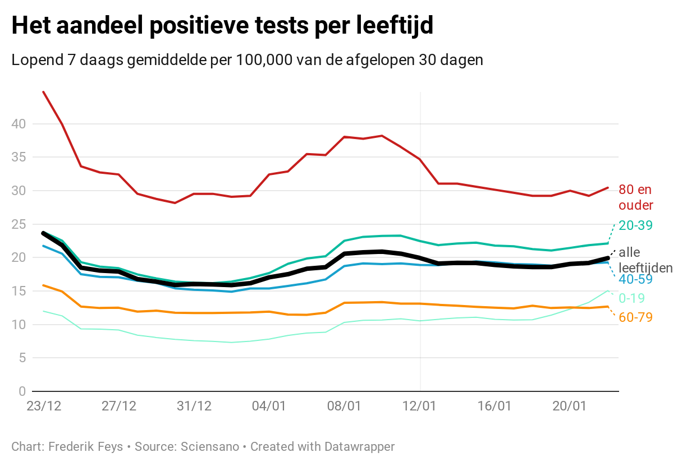

```{r setup, include=FALSE}
knitr::opts_chunk$set(echo = F)
library(dplyr)
```


```{r}
consolidate_days = 4
number_days_analyse = 30
rate_per= 100000

d <- read.csv("https://epistat.sciensano.be/Data/COVID19BE_CASES_AGESEX.csv")
d['date'] = as.Date(d$DATE)

#get cases by agegroup
d_0_9 <- d[which( d$AGEGROUP == "0-9") , ]
d_10_19 <- d[which( d$AGEGROUP == "10-19") , ]
d_20_29 <- d[which( d$AGEGROUP == "20-29") , ]
d_30_39 <- d[which( d$AGEGROUP == "30-39") , ]
d_40_49 <- d[which( d$AGEGROUP == "40-49") , ]
d_50_59 <- d[which( d$AGEGROUP == "50-59") , ]
d_60_69 <- d[which( d$AGEGROUP == "60-69") , ]
d_70_79 <- d[which( d$AGEGROUP == "70-79") , ]
d_80_89 <- d[which( d$AGEGROUP == "80-89") , ]
d_90_ <- d[which( d$AGEGROUP == "90+") , ]

#aggregate cases by date
d_0_9 <-aggregate(x=d_0_9$CASES, FUN=sum, by = list(date = d_0_9$DATE))
d_10_19 <-aggregate(x=d_10_19$CASES, FUN=sum, by = list(date = d_10_19$DATE))
d_20_29 <-aggregate(x=d_20_29$CASES, FUN=sum, by = list(date = d_20_29$DATE))
d_30_39 <-aggregate(x=d_30_39$CASES, FUN=sum, by = list(date = d_30_39$DATE))
d_40_49 <-aggregate(x=d_40_49$CASES, FUN=sum, by = list(date = d_40_49$DATE))
d_50_59 <-aggregate(x=d_50_59$CASES, FUN=sum, by = list(date = d_50_59$DATE))
d_60_69 <-aggregate(x=d_60_69$CASES, FUN=sum, by = list(date = d_60_69$DATE))
d_70_79 <-aggregate(x=d_70_79$CASES, FUN=sum, by = list(date = d_70_79$DATE))
d_80_89 <-aggregate(x=d_80_89$CASES, FUN=sum, by = list(date = d_80_89$DATE))
d_90_ <-aggregate(x=d_90_$CASES, FUN=sum, by = list(date = d_90_$DATE))


#7 day avg 

make_7_day_avg <- function(d_7, column_name) {
  
  #validate first that each set has a value for every date
  d_7['date'] = as.Date(d_7$date)
  startdate <- min(d_7$date)
  
  exp_date = startdate + 1
  obs_date = d_7[which( d_7$date == exp_date) , ]
  j=0
  
  for (i in 1:nrow(d_7)) {

    if (nrow(obs_date) == 0) {
      d_7[nrow(d_7) + 1, 1] = exp_date
      d_7[nrow(d_7) , 2] = 0
      j=j+1 
    }
    
    exp_date = exp_date + 1
    obs_date = d_7[which( d_7$date == exp_date) , ]
    
  }
  
  # if (j>0) {
  #   print(j)
  #   print("dates created")
  # }
  
  
  # calc avgs

  d_7['date'] = as.Date(d_7$date)
  startdate <- min(d_7$date)
  date_to_avg <- startdate + 7
  days_to_avg <- nrow(d_7) - 4 # rule of 4, due to slow reporting nr from 4 days in past reliable
  
  df <- data.frame("2020-01-01", '0')
  names(df) <- c("date", 'x')
  df$date = as.Date(df$date, origin="1970-01-01")
  df$x = as.integer(df$x)
  
  lowerdate = startdate
  upperdate = date_to_avg
  
  for (i in 1:days_to_avg) {
    row = d_7[which( d_7$date > lowerdate & d_7$date <= upperdate) , ]
    daily_avg = round(sum(row$x) / 7, 0)
    rm(row)
    
    df[nrow(df) + 1, 1] = upperdate
    df[nrow(df) , 2] = daily_avg
    
    lowerdate <- lowerdate + 1
    upperdate <- upperdate + 1
  }
  
  # name new dataset column
  names(df)[names(df)=="x"] <- column_name
  
  # truncate
  df <- df[df$date >= startdate, ]
  
  return(df)
}

d_0_9 <- make_7_day_avg(d_0_9, "l_0_9")
d_10_19 <- make_7_day_avg(d_10_19, "l_10_19")
d_20_29 <- make_7_day_avg(d_20_29, "l_20_29")
d_30_39 <- make_7_day_avg(d_30_39, "l_30_39")
d_40_49 <- make_7_day_avg(d_40_49, "l_40_49")
d_50_59 <- make_7_day_avg(d_50_59, "l_50_59")
d_60_69 <- make_7_day_avg(d_60_69, "l_60_69")
d_70_79 <- make_7_day_avg(d_70_79, "l_70_79")
d_80_89 <- make_7_day_avg(d_80_89, "l_80_89")
d_90_ <- make_7_day_avg(d_90_, "l_90+")

# join to one table
dm <- left_join(d_0_9, d_10_19, by = "date")
dm <- left_join(dm, d_20_29, by = "date")
dm <- left_join(dm, d_30_39, by = "date")
dm <- left_join(dm, d_40_49, by = "date")
dm <- left_join(dm, d_50_59, by = "date")
dm <- left_join(dm, d_60_69, by = "date")
dm <- left_join(dm, d_70_79, by = "date")
dm <- left_join(dm, d_80_89, by = "date")
dm <- left_join(dm, d_90_, by = "date")

# complete cases
complete_records <- dm[complete.cases(dm[2:11]),]

# to adress reporting issues, used consolidated cases, so truncate up to five days ago
complete_records <- complete_records[complete_records$date <= Sys.Date()-consolidate_days, ]

# truncate to last 30 days
complete_records <- complete_records[complete_records$date >= Sys.Date()-(number_days_analyse+consolidate_days), ]

# plot
d <- complete_records
d['label_date'] = NULL
d['label_date'] = as.character(d$date, format = "%d/%m")

# merge age groups to make grapgh reading easier
d$l_0_19 <- d$l_0_9 + d$l_10_19
d$l_20_39 <- d$l_20_29 + d$l_30_39
d$l_40_59 <- d$l_40_49 + d$l_50_59
d$l_60_79 <- d$l_60_69 + d$l_70_79
d$l_80_ <- d$l_80_89 + d$`l_90+`


# all_ages mean and median
d$l_all_mean <- rowMeans(d[ , c(2:11)])

#calc rates
pop_l_0_19 = 2569322
pop_l_20_39 = 2899935
pop_l_40_59 = 3095167
pop_l_60_79 = 2271430
pop_l_80_ = 656787
  
d$l_0_19_rate <- d$l_0_19 / pop_l_0_19 * rate_per
d$l_20_39_rate <- d$l_20_39 / pop_l_20_39 * rate_per
d$l_40_59_rate <- d$l_40_59 / pop_l_40_59 * rate_per
d$l_60_79_rate <- d$l_60_79 / pop_l_60_79 * rate_per
d$l_80__rate <- d$l_80_ / pop_l_80_ * rate_per
d$l_all_mean_rate <- rowMeans(d[ , c(19:23)])

library(ISOweek)
d$wknr <- ISOweek(d$date)

setwd("~/Documents/wetenschap/covid-19/infosheets")
write.csv(d, "./data/cases_age.csv")

```

Voor alle leeftijden zien we dat de afgelopen maand het aandeel positieve tests stabiel blijft. De curves hebben een gelijkaardig verloop. Het aandeel positieve tests is laagste bij de 60-79 jarigen en bij de kinderen & jongeren. Het hoogste bij de 80 plussers, een groep met een [verhoogde kans voor opname op intensieve zorgen](http://covid-19.sciensano.be/sites/default/files/Covid19/COVID-19_THEMATIC%20REPORT_COVID-19%20HOSPITALISED%20PATIENTS_NL.pdf). 



[bekijk grafiek in volledig scherm](https://datawrapper.dwcdn.net/bKhLb/1/)

De 80 plussers hebben ook een [hogere kans op overlijden bij covid](https://datastudio.google.com/embed/reporting/c14a5cfc-cab7-4812-848c-0369173148ab/page/QTSKB). Hun aandeel positieve tests is ongeveer dubbel zo groot als het gemiddelde voor alle leeftijden. 

**Conclusie: We zien geen aanwijzingen dat een golf van besmettingen van kinderen & jongeren overgaat op de meest kwetsbare 80 plussers. Voor de meest leeftijden zien we dezelfde trend van stabiliteit. Voor kinderen & jongeren zien we het laagste aandeel positieve tests. Het hoogste aandeel zijn we bij 80 plussers. Er is dus bewijs dat coronamaatregelen best gericht zijn op de meest kwetsbare groep 80 plussers.**

## Beleid

Zoals collega's in Oxford CEBM aangeven, dienen we kinderen die besmettelijk zijn én griepachtige klachten hebben te identificeren, hun contacten te tracen en de kinderen te isoleren. Het advies is te stoppen met het massaal testen van gezonde kinderen & jongeren (op school). De massa-tests zijn dan schadelijk door vals positieven (onnodige quarantaine) en vals negatieven (gemiste besmettingen). Er is degelijk bewijs dat het doorgeven van kinderen naar volwassenen beperkt is. Vervang massascreening-tests door het isoleren van lagere schoolkinderen die duidelijke symptomen hebben. 
