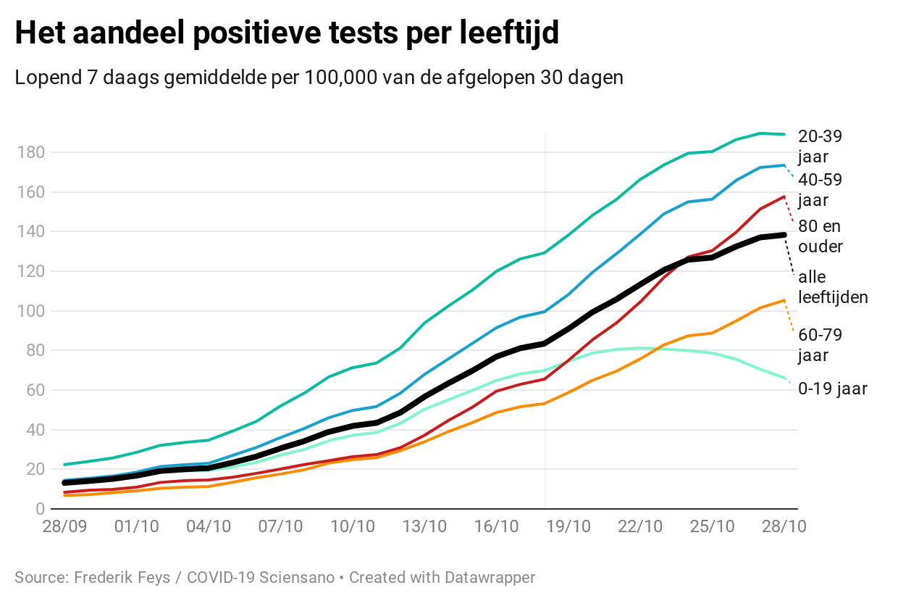

```{r setup, include=FALSE}
knitr::opts_chunk$set(echo = F)
library(dplyr)
```

Er is veel te doen over de rol die jongeren zouden hebben in het 'besmetten' van de meest kwetsbare groepen in de bevolking. Zo vaardigde minister Ben Weyts alweer een nieuwe coronamaatregel uit: [hij verlengt de Herfstvakantie](https://www.vrt.be/vrtnws/nl/2020/10/25/ook-vlaanderen-verlengt-herfstvakantie-tot-en-met-11-november/) in de hoop dat na de vakantie minder besmettingen zullen zijn. Dit leidt tot een sfeer van beschuldiging. Alsof jongeren zouden kiezen ouderen te infecteren. Dit creëert een stigma op jongeren. Het ondermijnt onze empathie met hen. Mogelijks twijfelen jongeren zo om behandeling te zoeken of een test en quarantaine te doen. In realiteit is het een virus, dat zich verspreidt onder mensen. Niet meer, niet minder. 

```{r }
consolidate_days = 5
number_days_analyse = 45
rate_per= 100000

d <- read.csv("https://epistat.sciensano.be/Data/COVID19BE_CASES_AGESEX.csv")
d['date'] = as.Date(d$DATE)

#get cases by agegroup
d_0_9 <- d[which( d$AGEGROUP == "0-9") , ]
d_10_19 <- d[which( d$AGEGROUP == "10-19") , ]
d_20_29 <- d[which( d$AGEGROUP == "20-29") , ]
d_30_39 <- d[which( d$AGEGROUP == "30-39") , ]
d_40_49 <- d[which( d$AGEGROUP == "40-49") , ]
d_50_59 <- d[which( d$AGEGROUP == "50-59") , ]
d_60_69 <- d[which( d$AGEGROUP == "60-69") , ]
d_70_79 <- d[which( d$AGEGROUP == "70-79") , ]
d_80_89 <- d[which( d$AGEGROUP == "80-89") , ]
d_90_ <- d[which( d$AGEGROUP == "90+") , ]

#aggregate cases by date
d_0_9 <-aggregate(x=d_0_9$CASES, FUN=sum, by = list(date = d_0_9$DATE))
d_10_19 <-aggregate(x=d_10_19$CASES, FUN=sum, by = list(date = d_10_19$DATE))
d_20_29 <-aggregate(x=d_20_29$CASES, FUN=sum, by = list(date = d_20_29$DATE))
d_30_39 <-aggregate(x=d_30_39$CASES, FUN=sum, by = list(date = d_30_39$DATE))
d_40_49 <-aggregate(x=d_40_49$CASES, FUN=sum, by = list(date = d_40_49$DATE))
d_50_59 <-aggregate(x=d_50_59$CASES, FUN=sum, by = list(date = d_50_59$DATE))
d_60_69 <-aggregate(x=d_60_69$CASES, FUN=sum, by = list(date = d_60_69$DATE))
d_70_79 <-aggregate(x=d_70_79$CASES, FUN=sum, by = list(date = d_70_79$DATE))
d_80_89 <-aggregate(x=d_80_89$CASES, FUN=sum, by = list(date = d_80_89$DATE))
d_90_ <-aggregate(x=d_90_$CASES, FUN=sum, by = list(date = d_90_$DATE))


#7 day avg 

make_7_day_avg <- function(d_7, column_name) {
  
  #validate first that each set has a value for every date
  d_7['date'] = as.Date(d_7$date)
  startdate <- min(d_7$date)
  
  exp_date = startdate + 1
  obs_date = d_7[which( d_7$date == exp_date) , ]
  j=0
  
  for (i in 1:nrow(d_7)) {

    if (nrow(obs_date) == 0) {
      d_7[nrow(d_7) + 1, 1] = exp_date
      d_7[nrow(d_7) , 2] = 0
      j=j+1 
    }
    
    exp_date = exp_date + 1
    obs_date = d_7[which( d_7$date == exp_date) , ]
    
  }
  
  # if (j>0) {
  #   print(j)
  #   print("dates created")
  # }
  
  
  # calc avgs

  d_7['date'] = as.Date(d_7$date)
  startdate <- min(d_7$date)
  date_to_avg <- startdate + 7
  days_to_avg <- nrow(d_7) - 4 # rule of 4, due to slow reporting nr from 4 days in past reliable
  
  df <- data.frame("2020-01-01", '0')
  names(df) <- c("date", 'x')
  df$date = as.Date(df$date, origin="1970-01-01")
  df$x = as.integer(df$x)
  
  lowerdate = startdate
  upperdate = date_to_avg
  
  for (i in 1:days_to_avg) {
    row = d_7[which( d_7$date > lowerdate & d_7$date <= upperdate) , ]
    daily_avg = round(sum(row$x) / 7, 0)
    rm(row)
    
    df[nrow(df) + 1, 1] = upperdate
    df[nrow(df) , 2] = daily_avg
    
    lowerdate <- lowerdate + 1
    upperdate <- upperdate + 1
  }
  
  # name new dataset column
  names(df)[names(df)=="x"] <- column_name
  
  # truncate
  df <- df[df$date >= startdate, ]
  
  return(df)
}

d_0_9 <- make_7_day_avg(d_0_9, "l_0_9")
d_10_19 <- make_7_day_avg(d_10_19, "l_10_19")
d_20_29 <- make_7_day_avg(d_20_29, "l_20_29")
d_30_39 <- make_7_day_avg(d_30_39, "l_30_39")
d_40_49 <- make_7_day_avg(d_40_49, "l_40_49")
d_50_59 <- make_7_day_avg(d_50_59, "l_50_59")
d_60_69 <- make_7_day_avg(d_60_69, "l_60_69")
d_70_79 <- make_7_day_avg(d_70_79, "l_70_79")
d_80_89 <- make_7_day_avg(d_80_89, "l_80_89")
d_90_ <- make_7_day_avg(d_90_, "l_90+")

# join to one table
dm <- left_join(d_0_9, d_10_19, by = "date")
dm <- left_join(dm, d_20_29, by = "date")
dm <- left_join(dm, d_30_39, by = "date")
dm <- left_join(dm, d_40_49, by = "date")
dm <- left_join(dm, d_50_59, by = "date")
dm <- left_join(dm, d_60_69, by = "date")
dm <- left_join(dm, d_70_79, by = "date")
dm <- left_join(dm, d_80_89, by = "date")
dm <- left_join(dm, d_90_, by = "date")

# complete cases
complete_records <- dm[complete.cases(dm[2:11]),]

# to adress reporting issues, used consolidated cases, so truncate up to five days ago
complete_records <- complete_records[complete_records$date <= Sys.Date()-consolidate_days, ]

# truncate to last 30 days
complete_records <- complete_records[complete_records$date >= Sys.Date()-(number_days_analyse+consolidate_days), ]

# plot
d <- complete_records
d['label_date'] = NULL
d['label_date'] = as.character(d$date, format = "%d/%m")

# merge age groups to make grapgh reading easier
d$l_0_19 <- d$l_0_9 + d$l_10_19
d$l_20_39 <- d$l_20_29 + d$l_30_39
d$l_40_59 <- d$l_40_49 + d$l_50_59
d$l_60_79 <- d$l_60_69 + d$l_70_79
d$l_80_ <- d$l_80_89 + d$`l_90+`


# all_ages mean and median
d$l_all_mean <- rowMeans(d[ , c(2:11)])

#calc rates
pop_l_0_19 = 2569322
pop_l_20_39 = 2899935
pop_l_40_59 = 3095167
pop_l_60_79 = 2271430
pop_l_80_ = 656787
  
d$l_0_19_rate <- d$l_0_19 / pop_l_0_19 * rate_per
d$l_20_39_rate <- d$l_20_39 / pop_l_20_39 * rate_per
d$l_40_59_rate <- d$l_40_59 / pop_l_40_59 * rate_per
d$l_60_79_rate <- d$l_60_79 / pop_l_60_79 * rate_per
d$l_80__rate <- d$l_80_ / pop_l_80_ * rate_per
d$l_all_mean_rate <- rowMeans(d[ , c(19:23)])

setwd("~/Documents/wetenschap/covid-19/infosheets")
write.csv(d, "./data/cases_age.csv")

```

*Is er bewijs dat besmettingen overgaan van jong naar oud?*

Voor alle leeftijden zien we dat het aandeel positieve tests toeneemt. De curves lopen vrij gelijkaardig, behalve voor de kinderen & jongeren (0-19 jaar). Die curve daalt sinds een kleine twee weken. Ook hun aandeel positieve tests is het laagste. Het laagst bij de 60-79 jarigen, een groep met [verhoogde kans voor opname op intensieve zorgen](http://covid-19.sciensano.be/sites/default/files/Covid19/COVID-19_THEMATIC%20REPORT_COVID-19%20HOSPITALISED%20PATIENTS_NL.pdf). 


[bekijk grafiek in volledig scherm](https://datawrapper.dwcdn.net/2GJzA/2/)

De 80 jarigen en ouder hebben een [hogere kans op overlijden bij covid](https://datastudio.google.com/embed/reporting/c14a5cfc-cab7-4812-848c-0369173148ab/page/QTSKB). Hun aandeel positieve tests zit net boven het gemiddelde voor alle leeftijden. Het grootste aandeel positieve tests zit bij de 20 tot 40 jarigen.

**Conclusie: Voor de meest leeftijden zien we dezelfde trend van langzame toename. Voor kinderen & jongeren zien we het laagste aandeel positieve tests. De trend bij hen is dalend. Er is dus geen bewijs dat het virus zich vooral verspreidt van kinderen/jongeren naar de meest kwetsbaren**

Over alle leeftijden, testte op 28 oktober 2020 dagelijks ongeveer 1 op 725 mensen positief. Ik heb geen idee wie daarvan ook echt covid-19 heeft. De publieke gezondheidsdienst van de UK [schat 30%](https://t.co/bfxhjpA6ar?amp=1). Dus zou dagelijks 1 op de 2,175 Belgen positief testen & ziek zijn.

Het zou goed zijn dat [Sciensano](https://twitter.com/Sciensano) transparant rapporteert over het aantal mensen dat klachten heeft, alsook hun besmettelijkheid bij het moment van staalname voor de coronatest. Zo kunnen we beter de eventuele risico's van de situatie inschatten en prioriteiten stellen. Zoals collega's in Oxford CEBM aangeven, dienen we kinderen die besmettelijk zijn én griepachtige klachten hebben te identificeren, contacten te tracen en te isoleren. Het advies is te stoppen met testen uitvoeren in de lagere school. Er is degelijk bewijs dat het doorgeven van kinderen naar volwassenen beperkt is. Vervang deze testing door het isoleren van lagere schoolkinderen die duidelijke symptomen hebben. 

Misschien kan [Celeval](https://www.info-coronavirus.be/en/celeval/) (de adviesgroep van experten) dit onder de dringende aandacht brengen? 


```{r pressure, echo=FALSE}
plot(d$l_all_mean, 
     type = "l",
     xlab = "dagen",
     ylab = "cases",
     ylim = c(0,4500),
     main="7 daags gemiddelde cases over leeftijden tijdens afgelopen 30 dagen",
     sub = "corona.frederikfeys.be"
     )
lines(d$l_0_19, type = "l", col="blue" )
lines(d$l_20_39, type = "l", col="green" )
lines(d$l_40_59, type = "l", col="yellow" )
lines(d$l_60_79, type = "l", col="purple" )
lines(d$l_80_, type = "l", col="red" )

# Add legend to plot
legend("topleft",                                       
       legend = c("alle leeftijden", "0-19 jaar", "20-39 jaar","40-59 jaar","60-79 jaar","80 jaar en ouder"),
       col = c("black", "blue", "green", "yellow", "purple", "red"),
       lty = 1,
       cex=1,
       box.lty=0)

# rates
plot(d$l_all_mean_rate, 
     type = "l",
     xlab = "dagen",
     ylab = "cases per 100,000",
     ylim = c(0,180),
     main="Positieve tests (7 daags gemiddelde) over leeftijden tijdens afgelopen 30 dagen",
     sub = "blog: corona.frederikfeys.be"
)
lines(d$l_0_19_rate, type = "l", col="blue" )
lines(d$l_20_39_rate, type = "l", col="green" )
lines(d$l_40_59_rate, type = "l", col="yellow" )
lines(d$l_60_79_rate, type = "l", col="purple" )
lines(d$l_80__rate, type = "l", col="red" )

# Add legend to plot
legend("topleft",                                       
       legend = c("alle leeftijden", "0-19 jaar", "20-39 jaar","40-59 jaar","60-79 jaar","80 jaar en ouder"),
       col = c("black", "blue", "green", "yellow", "purple", "red"),
       lty = 1,
       cex=1,
       box.lty=0)
```

