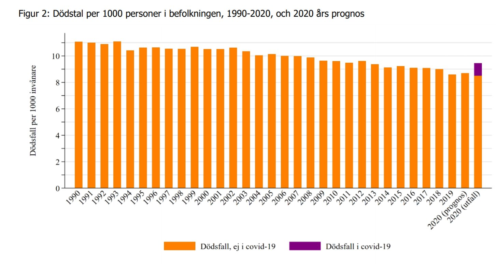

```{r setup, include=FALSE}
knitr::opts_chunk$set(echo = TRUE)
```

# Zweden

De meesten beschouwen de Zweedse aanpak van de coronacrisis onverantwoord. Ze zou onschuldige mensen de dood indrijven. Zijn er in 2020 dan veel meer doden gevallen dan in andere jaren? Deze grafiek toont de gegevens tussen november en mei Er zijn evenveel of zelfs minder doden gevallen tijdens de Zweedse coronacrisis.




# België

De reactie van de Belgische overheid vinden de meesten dan weer wél verantwoord. De bevolking moest onder huisarrest. En de overheid blijft tot op vandaag (juli 2020) maatregelen uitvaardigen die de persoonlijke vrijheden aantasten. 

## Een kleine quiz

We doen dezelfde berekening voor België. Cijfers van [STATBel](https://statbel.fgov.be/en/open-data/number-deaths-day-sex-district-age).  Welk nummer onder de staaf is het aantal doden in 2020? 
```{r echo=F}
d <- read.delim('data/agg_data.csv', sep = ";")
d <- d[order(d$nr),]   

cols = "cornflowerblue"

barplot(d$cum_deaths_100k, names.arg = d$nr, main = "België: overzicht sterftecijfers (alle oorzaken) afgelopen 12 jaar 
        periode Januari tot Juni", xlab = "Jaar Januari / Jaar Juni", ylab="Overlijdens per 100,000", space=0.5, ylim=c(0, 650) , col = cols, border = NA, cex.names=1)
```

Nummer 10? Goed zo! Dat zijn de cijfers voor 2020. Laten we dit even mooier presenteren.

```{r echo=F}

attach(d)
d <-d[ order(year),] 

cols <- ifelse(d$year == 2020, "chocolate1","cornflowerblue")
barplot(d$cum_deaths_100k, names.arg = d$year, main = "België: overzicht sterftecijfers (alle oorzaken) afgelopen 12 jaar 
        periode Januari tot Juni", xlab = "Jaar Januari / Jaar Juni", ylab="Overlijdens per 100,000", space=0.5, ylim=c(0, 650) , col = cols, border = NA, cex.names=0.6)
```

Het totaal aantal overlijdens is ongeveer hetzelfde doorheen de jaren, met misschien een zeer lichte stijging in 2020. 

